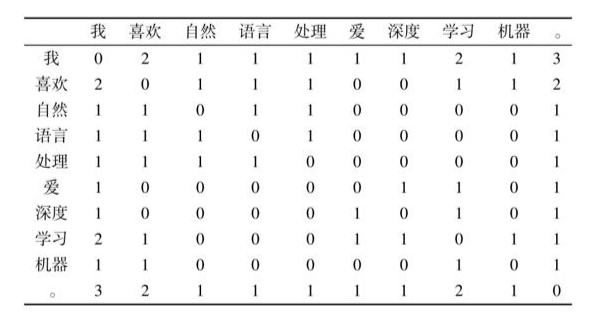

# 词向量

## 文本的表述

若要利用计算机对自然语言进行处理，首先需要解决语言在计算机内部的存储和计算问题。字符串（String）是文本最自然，也是最常用的机内存储形式。

所谓字符串，即字符序列，而其中的一个字符本质上就是一个整数。基于字符串的文本表示方式可以实现简单的字符串增删改查等编辑任务，并能够通过**编辑距离**等算法计算两个字符串之间的字面相似度。

在使用字符串表示（也叫符号表示）计算文本的语义信息时，往往需要使用基于规则的方法。例如，要判断一个句子的情感极性（褒义或贬义），规则的形式可能为：如果句子中出现“喜欢”、“漂亮”等词则为褒义；如果出现“讨厌”、“丑陋”等词则为贬义。

这种基于规则的方法存在很多问题：

1. 首先，规则的归纳依赖专家的经验，需要花费大量的人力、物力和财力；
2. 其次，规则的表达能力有限，很多语言现象无法用简单的规则描述；
3. 最后，随着规则的增多，规则之间可能存在矛盾和冲突的情况，导致最终无法做出决策。例如，一个句子中既出现了“喜欢”，又出现了“讨厌”，那么其极性应该是什么呢？

## One-Hot 向量

为了解决基于规则的方法存在的以上诸多问题，基于机器学习的自然语言处理技术应运而生，其最本质的思想是将文本表示为向量，其中的每一维代表一个特征。在进行决策的时候，只要对这些特征的相应值进行加权求和，就可以得到一个分数用于最终的判断。

仍然以情感极性识别为例，一种非常简单的将原始文本表示为向量的方法为：令向量 X 的每一维表示某个词在该文本中出现的次数，如果某个词在该句中没有出现，则相应的维数被设置为0，例如：
$$
“我，喜欢，电影”：
X_{1}=[1,0,1,1]\\
“我，讨厌，电影”：
X_{2}=[1,1,0,1]
$$

可见，输入向量x的大小恰好为整个词表（所有不相同的词）的大小。

然后就可以根据每个词对判断情感极性的重要性进行加权，如“喜欢”对应的权重可能比较大，而“讨厌”对应的权重可能为负数，对于情感极性影响比较小的词，如“我”、“电影”等，对应的权重可能会趋近于0。

这种文本表示的方法是两种技术的组合，即词的**独热表示**和文本的**词袋表示**。除了可以应用于基于机器学习的方法，文本向量表示还可以用于计算两个文本之间的相似度，即使用余弦函数等度量函数表示两个向量之间的相似度，并应用于信息检索等任务。但是，词的独热表示容易导致**数据稀疏问题**。

## 分布式语义假设

 Harris 提出的**分布假说**中为这一设想提供了理论基础，即**上下文相似的词，其语义也相似。**基于这种思想，John Rupert Firth于1957年提出了分布式语义假设：词的含义可由其上下文的分布进行表示，即**词的语义由其上下文决定**。

 这很好理解，人们在阅读过程中遇到从未见过的词时，通常会根据上下文来推断其含义以及相关属性。

例如，假设语料库中有以下三句话：

+ 我 喜欢 自然 语言 处理 。
+ 我 爱 深度 学习 。
+ 我 喜欢 机器 学习 。

词语共现频次表：

表中的每一行代表一个词的向量。通过计算两个向量之间的余弦函数，就可以计算两个词的相似度。如“喜欢”和“爱”，由于有共同的上下文“我”和“学习”，使得它们之间具有了一定的相似性，而不是如独热表示一样，没有任何关系。

除了词，上下文的选择有很多种方式，而选择不同的上下文得到的词向量表示性质会有所不同。例如，可以使用词在句子中的一个固定窗口内的词作为其上下文，也可以使用所在的文档本身作为上下文。前者得到的词表示将更多地反映词的局部性质：具有相似词法、句法属性的词将会具有相似的向量表示。而后者将更多地反映词代表的主题信息。

不过，直接使用与上下文的共现频次作为词的向量表示，至少存在以下三个问题：

1. 高频词误导计算结果。如上例中，“我”、“。”与其他词的共现频次很高，导致实际上可能没有关系的两个词由于都和这些词共现过，从而产生了较高的相似度。
2. 共现频次无法反映词之间的高阶关系。例如，假设词“A”与“B”共现过，“B”与“C”共现过，“C”与“D”共现过，通过共现频次，只能获知“A”与“C”都与“B”共现过，它们之间存在一定的关系，而“A”与“D”这种高阶的关系则无法知晓。
3.  仍然存在稀疏性的问题。即向量中仍有大量的值为0，这一点从表中也可以看出。

# 下周任务

1. word2vec原理和方法
2. N-gram语言模型
3. 了解主流的自然语言处理任务：分词、词性标注、句法分析等

# 补充了解（不做要求）

1. 字符串的编辑距离算法（Edit-Distance）